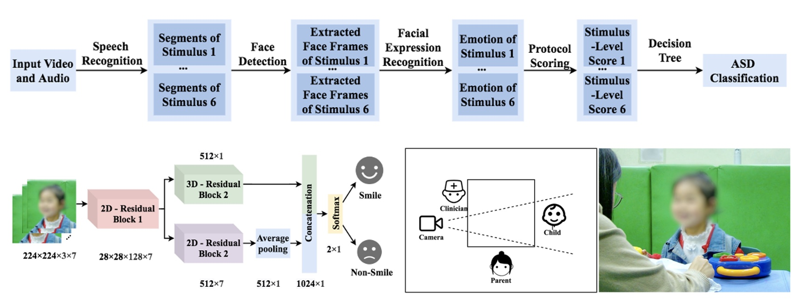
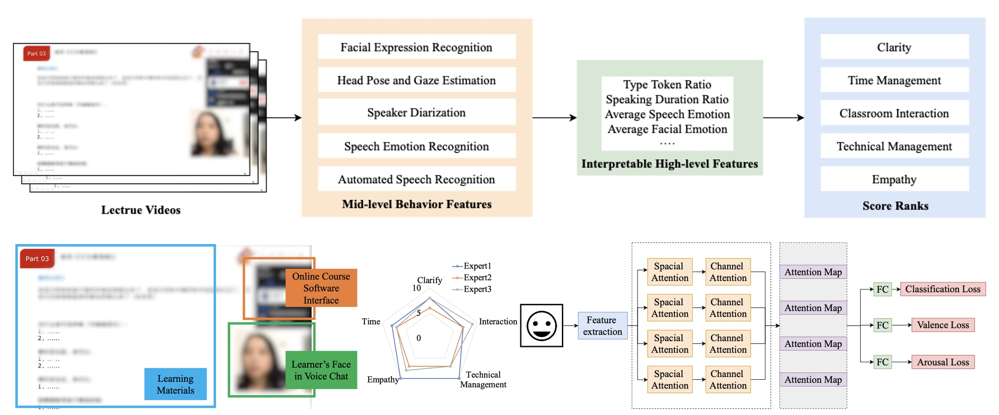

## Welcome to Yueran's Pages

Hello, My name is Yueran Pan. In Chinese pinyin order, my names' capital letters are __PY__ and __R__, which means __Python__ and __R__, so I am fated to devote my life to data science. I achieved MSc Data Science with distinction at [the London School of Economics and Political Science](https://www.lse.ac.uk) and BSc Statistics at [Wuhan University](https://www.whu.edu.cn). I have two-year research experience in SMIIP Lab at  [Duke Kunshan University](https://dukekunshan.edu.cn). Currently, I am a Ph.D. candidate in Computer Science supervised by [Ming Li](https://www.researchgate.net/profile/Ming_Li372)  at Wuhan University. Most of my studies are about applying data analysis methods to help children with autism. I believe that AI would share my love.

## Publications and Papers

### Responsive Social Smile: A Machine Learning based Multimodal Behavior Assessment Framework towards Early Stage Autism Screening
International Conference on Pattern Recognition (ICPR) 2020

#### *Abstract*
Autism spectrum disorder (ASD) is a neuro- developmental disorder, which causes deficits in social lives. Early screening of ASD for young children is important to reduce the impact of ASD on people’s lives. Traditional screening methods mainly rely on protocol-based interviews and subjective evaluations from clinicians and domain experts, which requires advanced expertise and intensive labor. To standardize the process of ASD screening, we design a ”Responsive Social Smile” protocol and the associated experimental setup. Moreover, we propose a machine learning based assessment framework for early ASD screening. By integrating speech recognition and computer vision technologies, the proposed framework can quantitatively analyze children’s behaviors under well-designed protocols. We collect 196 stimulus samples from 41 children with an average age of 23.34 months, and the proposed method obtains 85.20% accuracy for predicting stimulus scores and 80.49% accuracy for the final ASD prediction. This result indicates that our model approaches the average level.

#### *Repository*
https://github.com/sparklingyueran/Responsive-Social-Smile-Facial-Expression-Recognition

### A Multimodal Framework for Automated Teaching Quality Assessment of One-to-many Online Instruction Videos
International Conference on Pattern Recognition (ICPR) 2022

#### *Abstract*
In the post-pandemic era, online courses have been adopted universally. Manually assessing online course teaching quality requires significant time and professional pedagogy experience. To address this problem, we design an evaluation protocol and propose a multimodal machine learning framework for automated teaching quality assessment of one-to-many online instruction videos. Our framework evaluates online teaching quality from five aspects, namely Clarity, Classroom interaction, Technical management of online teaching, Empathy, and Time management. Our method includes mid-level behavior feature extraction, high-level interpretable feature extraction, and supervised learning prediction. Our automated multimodal teaching quality assessment system achieves comparable performance to human annotators on our one-to-many online instruction videos. For binary classification, the best average accuracy of five aspects is 0.898. For regression, the best average means square error is 0.527 on a 0-10 scale.

#### *Repository*
https://github.com/sparklingyueran/Online-Course-Assessment-Framework

